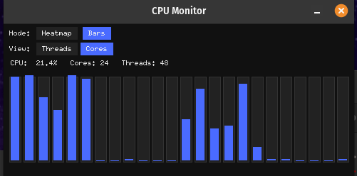
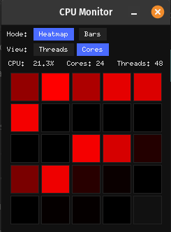

# 📊 CPU Monitor — Graphical CPU Heatmap & Bars for Linux

A modern, responsive CPU monitor for Linux desktops that ships both heatmap and bar views.  
Built with Python and Tkinter, it aims to outperform the stock monitors in GNOME, KDE, or macOS with instant, animated updates.

## 🌟 Features

- Heatmap mode with a black-to-red thermal-style intensity scale
- Live updates every 500 ms
- Threads view (displays all logical CPUs, e.g., 48 tiles on a 9965 system)
- Cores view (24 tiles, aggregating SMT threads with the `MAX(thread0, thread1)` strategy to reflect thermal reality)
- Bars mode with smooth animated bars and a purple theme
- Dynamic runtime switching between cores/threads and heatmap/bars views without restarting or rebuilding the canvas
- Cross-platform support (Linux/macOS) with only `psutil` as a dependency

## 📸 Screenshots

<div align="center">
  
  <br/>
  
</div>


## 🚀 Installation

Clone and install from source:

```bash
git clone https://github.com/YOURNAME/cpu-monitor.git
cd cpu-monitor
pip install .
```

For live development:

```bash
pip install -e .
```

Invoke the app from anywhere:

```bash
cpu-monitor
cpu-monitor --heatmap
```

## 🧠 Usage

Start in bars mode (default):

```bash
cpu-monitor
```

Start in heatmap mode:

```bash
cpu-monitor --heatmap
```

Switch views at runtime:

- Mode: Heatmap ↔ Bars  
- View: Threads ↔ Cores  

The GUI updates instantly with the selected view.

## 🏗 Project Layout

```text
cpu_monitor/
├── pyproject.toml
├── README.md
└── cpu_monitor/
    ├── __init__.py
    └── app.py               # main application
```

## 📦 Packaging Notes

Uses PEP 621 via `pyproject.toml`.  
CLI executable: `cpu-monitor`  
Only dependency: `psutil`

## 📝 Example Heatmap Behavior

- **Threads view:** all logical CPUs (e.g., 48 threads on a 9965)  
- **Cores view:** physical CPUs (e.g., 24 cores), combining hyperthreads with `MAX(thread0, thread1)`

## 🧩 Roadmap / Ideas

- GPU monitor integration (NVML → 5090 tile)  
- Combined CPU+GPU heatmap grid  
- Mini floating widget (always-on-top)  
- KDE/Wayland/GTK tray icon  
- Optional color themes (Cyberpunk Purple, Plasma Blue)  
- Hover tooltip for each core/thread


## 📄 License

[BSD 3-Clause License](LICENSE) — do whatever you want with it.

## ❤️ Author

John Furr
